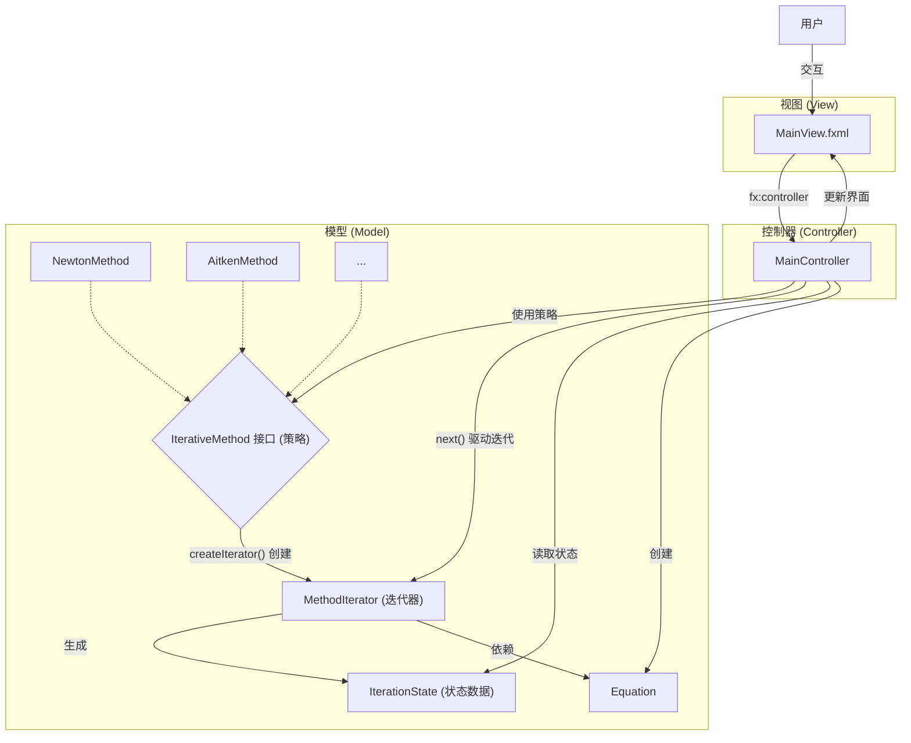

### Numercial-Analysis 

```mermaid
graph TD
    subgraph "视图 (View)"
        A[MainView.fxml]
    end

    subgraph "控制器 (Controller)"
        B[MainController]
    end

    subgraph "模型 (Model)"
        C{"IterativeMethod 接口 (策略)"}
        C1[NewtonMethod]
        C2[AitkenMethod]
        C3[...]
        
        E["MethodIterator (迭代器)"]
        F["IterationState (状态数据)"]
        D[Equation]
    end

    User[用户] -->|交互| A
    A -- "fx:controller" --> B

    B -- "使用策略" --> C
    
    C -- "createIterator()" 创建 --> E
    B -- "next()" 驱动迭代 --> E
    E -- "生成" --> F
    
    B -- "读取状态" --> F
    B -- "更新界面" --> A
    
    E -- "依赖" --> D
    B -- "创建" --> D

    %% 策略实现
    C1 -.-> C
    C2 -.-> C
    C3 -.-> C
```